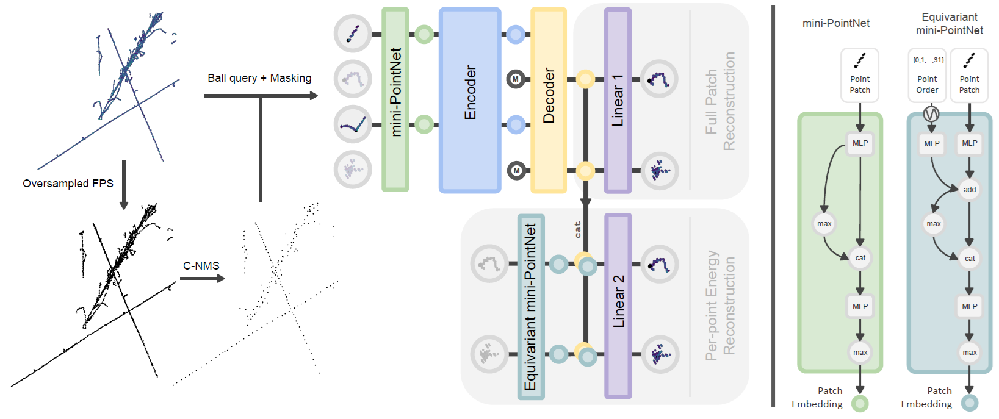

# PoLAr-MAE

Particle Trajectory Representation Learning with Masked Point Modeling

> [!NOTE]
> Example jupyter notebooks are currently being prepared. Come back soon!

[[`Paper`](https://arxiv.org/abs/2502.02558)][[`Dataset`](./DATASET.md)][[`Project`](https://youngsm.com/polarmae)][[`BibTeX`](#citing-polar-mae)]



## Installation

## 1. Installation

This codebase relies on a number of dependencies, some of which are difficult to get running. If you're using conda on Linux, use the following to create an environment and install the dependencies:

```bash
conda env create -f environment.yml
conda activate polarmae

# Install pytorch3d
cd extensions
git clone https://github.com/facebookresearch/pytorch3d.git
cd pytorch3d
MAX_JOBS=N pip install -e .

# Install C-NMS
cd ../cnms
MAX_JOBS=N pip install -e .

# Install polarmae
cd ../.. # should be in the root directory of the repository now
pip install -e .
```

> [!NOTE]
>environment.yml is a full environment specification, which includes an install of cuda 12.4, pytorch 2.1.5, and python 3.9.
> 
> `pytorch3d` and `cnms` are compiled from source, and will only be compiled for the CUDA device architecture of the visible GPU(s) available on the system.

Change `N` in `MAX_JOBS=N` to the number of cores you want to use for installing `pytorch3d` and `cnms`. At least 4 cores is recommended to compile `pytorch3d` in a reasonable amount of time. 

If you'd like to do the installation on your own, you will need the following dependencies:

- [CUDA](https://docs.nvidia.com/cuda/cuda-installation-guide-linux/index.html#)
- PyTorch 2.1.0, 2.1.1, 2.1.2, 2.2.0, 2.2.1, 2.2.2, 2.3.0, 2.3.1, 2.4.0 or 2.4.1.
- gcc & g++ >= 4.9 and < 13
- [pytorch3d](https://github.com/facebookresearch/pytorch3d)
- [PyTorch Lightning](https://github.com/Lightning-AI/pytorch-lightning)
- [NumPy](https://github.com/numpy/numpy)
- [Lightning-Utilities](https://github.com/Lightning-AI/utilities)
- [Scikit-Learn](https://github.com/scikit-learn/scikit-learn)
- [Omegaconf](https://github.com/omry/omegaconf)
- [h5py](https://github.com/h5py/h5py)

`pytorch3d` is usually the most difficult dependency to install. See the `pytorch3d` [INSTALL.md](https://github.com/facebookresearch/pytorch3d/blob/main/INSTALL.md) for more details.

There are a couple of extra dependencies that are optional, but recommended:

```bash
conda install wandb jupyter matplotlib
```

## PILArNet-M Dataset

We use and provide the 156 GB **PILArNet-M** dataset of >1M [LArTPC](https://www.symmetrymagazine.org/article/october-2012/time-projection-chambers-a-milestone-in-particle-detector-technology?language_content_entity=und) events. See [DATASET.md](DATASET.md) for more details, but the dataset is available at this [link](https://drive.google.com/drive/folders/1nec9WYPRqMn-_3m6TdM12TmpoInHDosb?usp=drive_link), or can be downloaded with the following command:

```bash
gdown --folder 1nec9WYPRqMn-_3m6TdM12TmpoInHDosb -O /path/to/save/dataset
```

> [!NOTE]
> `gdown` must be installed via e.g. `pip install gdown` or `conda install gdown`.


## Models


### Pretraining
| Model | Num. Events |  Config | SVM $\text{m}F_1$ | Download |
|-------|-------------|---------|-------|----------|
| Point-MAE | 1M | [pointmae.yml](https://github.com/DeepLearnPhysics/PoLAr-MAE/blob/main/configs/pointmae.yml) | 0.886 | [here](https://github.com/DeepLearnPhysics/PoLAr-MAE/releases/download/weights/mae_pretrain.ckpt) |
| PoLAr-MAE | 1M | [pointmae_multitask.yml](https://github.com/DeepLearnPhysics/PoLAr-MAE/blob/main/configs/pointmae_multitask.yml) | 0.895 | [here](https://github.com/DeepLearnPhysics/PoLAr-MAE/releases/download/weights/polarmae_pretrain.ckpt) |

Our evaluation consists of training an ensemble of linear SVMs to classify individual tokens (i.e., groups) as containing one or more classes. This is done via a One vs Rest strategy, where each SVM is trained to classify a single class against all others. $\text{m}F_1$ is the mean $F_1$ score over all semantic categories in the validation set of the PILArNet-M dataset.

### Semantic Segmentation

| Model | Training Method | Num. Events |  Config | $\text{m}F_1$ | Download |
|-------|-----------------|-------------|---------|-------|----------|
| Point-MAE | Linear probing | 10k | [part_segmentation_mae_peft.yml](https://github.com/DeepLearnPhysics/PoLAr-MAE/blob/main/configs/part_segmentation_mae_peft.yml) | 0.772 | [here](https://github.com/DeepLearnPhysics/PoLAr-MAE/releases/download/weights/mae_peft_segsem_10k.ckpt) |
| PoLAr-MAE | Linear probing | 10k | [part_segmentation_multitask_peft.yml](https://github.com/DeepLearnPhysics/PoLAr-MAE/blob/main/configs/part_segmentation_multitask_peft.yml) | 0.798 | [here](https://github.com/DeepLearnPhysics/PoLAr-MAE/releases/download/weights/polarmae_peft_segsem_10k.ckpt) |
| Point-MAE | FFT | 10k | [part_segmentation_mae_fft.yml](https://github.com/DeepLearnPhysics/PoLAr-MAE/blob/main/configs/part_segmentation_mae_fft.yml) | 0.831 | [here](https://github.com/DeepLearnPhysics/PoLAr-MAE/releases/download/weights/mae_fft_segsem_10k.ckpt) |
| PoLAr-MAE | FFT | 10k | [part_segmentation_multitask_fft.yml](https://github.com/DeepLearnPhysics/PoLAr-MAE/blob/main/configs/part_segmentation_multitask_fft.yml) | 0.837 | [here](https://github.com/DeepLearnPhysics/PoLAr-MAE/releases/download/weights/polarmae_fft_segsem_10k.ckpt) |

Our evaluation for semantic segmentation consists of 1:1 comparisons between the predicted and ground truth segmentations. $\text{m}F_1$ is the mean $F_1$ score over all semantic categories in the validation set of the PILArNet-M dataset.

## Training

### Pretraining

To pretrain Point-MAE, modify the [config file](https://github.com/DeepLearnPhysics/PoLAr-MAE/blob/main/configs/pointmae.yml) to include the path to the PILArNet-M dataset, and run the following command:

```bash
python -m polarmae.tasks.pointmae fit --config configs/pointmae.yml
```

To pretrain PoLAr-MAE, modify the [config file](https://github.com/DeepLearnPhysics/PoLAr-MAE/blob/main/configs/pointmae_multitask.yml) to include the path to the PILArNet-M dataset, and run the following command:

```bash
python -m polarmae.tasks.pointmae_multitask fit --config configs/pointmae_multitask.yml
```


### Semantic Segmentation

To train a semantic segmentation model, modify the [config file](https://github.com/DeepLearnPhysics/PoLAr-MAE/blob/main/configs/part_segmentation_mae_peft.yml) to include the path to the PILArNet-M dataset, and run the following command:

```bash
python -m polarmae.tasks.part_segmentation fit --config configs/part_segmentation_{mae,multitask}_{peft,fft}.yml \
                        --model.pretrained_ckpt_path path/to/pretrained/checkpoint.ckpt
```

where `{mae,multitask}` is either `mae` or `multitask`, and `{peft,fft}` is either `peft` or `fft`. You can either specify the pretrained checkpoint path in the config, or pass it as an argument to the command like above.


## Acknowledgements

This repository is built upon the lovely [Point-MAE](https://github.com/Pang-Yatian/Point-MAE) and [point2vec](https://github.com/kabouzeid/point2vec) repositories.

## Citing PoLAr-MAE

If you find this work useful, please cite the following paper:

```bibtex
@misc{young2025particletrajectoryrepresentationlearning,
      title={Particle Trajectory Representation Learning with Masked Point Modeling}, 
      author={Sam Young and Yeon-jae Jwa and Kazuhiro Terao},
      year={2025},
      eprint={2502.02558},
      archivePrefix={arXiv},
      primaryClass={hep-ex},
      url={https://arxiv.org/abs/2502.02558}, 
}
```
